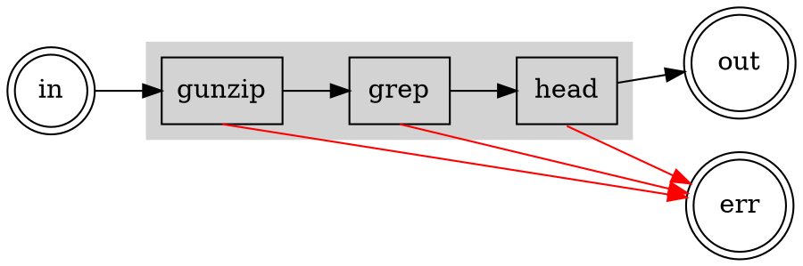

# The Zen of Errors

Error handling should just work. You should not have to check the exit code of
every process. Errors that occur upstream should flow downstream. You should not
have to manually `close` stuff.

This stuff should not be so complicated.

## TLDR

For the most part, you should just be able to use `proc` as is, letting most
errors bubble up, catching and handling errors when needed. Errors work the way
you would expect them to.

## The Process Perspective

If everything goes well, a process will read something from `stdin`, process it,
and write something to `stdout`. This will continue until `stdin` is exhausted.
At that point, the process with exit with code `0`.

If an error occurs, the process stops reading from `stdin` and exits with a
non-`0` error code.

## Streaming and Propagating Errors

Process `stdin`, `stdout`, and exit code match up well with asynchronous
iteration in Typescript. In general, `proc` attempts to process all of `stdout`
before checking for an exit code error, and it forwards errors that originate at
the input.

If a process has a non-zero `code`, an `ExitCodeError` is thrown. For a signal,
a `SignalError` is thrown. Errors are wrapped in a `SteamError` as they
propagate through a process in order to preserve the stack traces.

In short, it works pretty much as you would expect.

## An Example

In `bash`:

```shell
cat ./warandpeace.txt.gz | grep -v '^$' | head -n 100
```

In `Typescript`:

```typescript
await enumerable(file.readable)
  .run("gunzip")
  .run("grep", "-v", "^$")
  .run("head", "-n", "100")
  .transform(toLines)
  .flatten()
  .forEach((line) => console.log(line));
```

Errors flow from process input to process output. `stderr` is redirected to
process `stderr`.



Uncompress a file. Remove all the lines that are empty. Take the first 100
lines.

Assume there is an error in the data that causes `gunzip` to fail at some point.

### Scenario 1: A Data Error in the First 100 Lines

_There is an error early in the compressed data._

`gunzip` will decompress data in chunks and write the result to `stdout` as it
goes. When it reaches the error, it will exit with a non-zero `code`.

Once the (partial) output from `gunzip` has been fully read, `proc` will check
the `code` and throw an error. This will be propagated forward through the input
of `head`, and then forward again through the input of `grep` as the output of
each is exhausted.

Note that it is also possible that bad data in results in invalid data coming
out, and since we process all the output data before we get the error, we might
see the data error first.

### Scenario 2: A Data Error After the First 100 Lines

_There is an error later in the compressed data._

Once we get to line 100, `head` is done. It shuts down its input stream and
exits normally. Even if `gunzip` is unlucky enough to process the error data,
`head` is already done and success propagated forward. The error from `gunzip`
won't be able to propagate. Of course, if the error is _much_ later in the data,
it will never even be read. Once `head` has found 100 lines, it shuts down its
input, which in turn shuts down `gunzip`. The error never happens in the first
place.

In other words, upstream processes may continue to function for a short time
after the downstream processes have exited, assuming the downstream processes
don't need to process input fully. In most cases this should not matter. If an
upstream process has side effects, though, weird things could happen.
