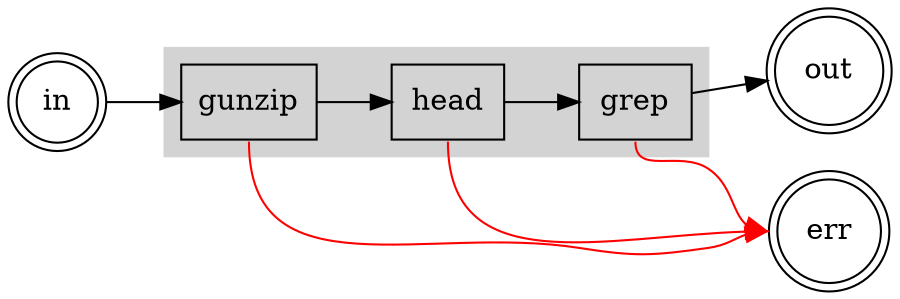

# The Zen of Errors

Error handling should just work. You should not have to check the exit code of
every process. Errors that occur upstream should flow downstream. You should not
have to manually `close` stuff.

## The Process Perspective

If everything goes well, a process will read something from `stdin`, process it,
and write something to `stdout`. This will continue until `stdin` is exhausted.
At that point, the process with exit with code `0`.

If an error occurs, the process stops reading from `stdin` and exits with a
non-`0` error code.

## Streaming and Propagating Errors

Process `stdin`, `stdout`, and exit code match up well with asynchronous
iteration in Typescript. In general, `proc` attempts to process all of `stdout`
before checking for an exit code error, and it forwards errors that originate at
the input.

If a process has a non-zero `code`, an `ExitCodeError` is thrown. For a signal,
a `SignalError` is thrown. Errors are wrapped in a `SteamError` as they
propagate through a process in order to preserve the stack traces.

In short, it works pretty much as you would expect.

## An Example

In `bash`:

```shell
cat ./warandpeace.txt.gz | grep -v '^$' | head -n 100
```

In `Typescript`:

```typescript
await runnable(file.readable)
  .run("gunzip")
  .run("grep", "-v", "^$")
  .run("head", "-n", "100")
  .transform(toLines)
  .flatten()
  .forEach((line) => console.log(line));
```



Uncompress a file. Remove all the lines that are empty. Take the first 100
lines.

Assume there is an error in the data that causes `gunzip` to fail at some point.

### Scenario 1: A Data Error in the First 100 Lines

_There is an error early in the compressed data._ `gunzip` will decompress data
in chunks and write the result to `stdout` as it goes. When it reaches the
error, it will exit with a non-zero `code`.

`proc` will check the `code` and throw an error. This will be propagated forward
through the input of `head`, and then forward again through the input of `grep`
as the output of each is exhausted.

Note that it is also possible that bad data in results in invalid data coming
out, and since we process all the output data before we get the error, we might
see the data error first.

### Scenario 2: A Data Error After the First 100 Lines

_There is an error later in the compressed data._ Once we get to line 100,
`head` shuts down the stream. Even if `gunzip` is unlucky enough to process the
error data, `head` is already done. The error won't propagate. Of course, if the
error is _much_ later in the data, it will never even be read. Once `head` has
found 100 lines, it shuts down its input, which in turn shuts down `gunzip`. The
error never happens in the first place.
