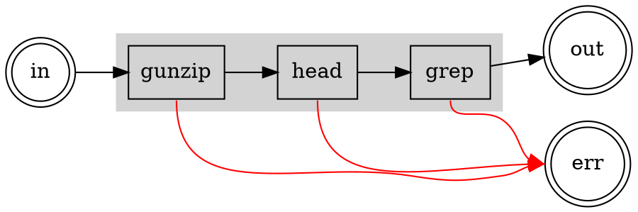

Next Up:

- Count words, count unique words, with tee in bash and proc, and that's the
  introduction.
  - fast code - use C libraries, go out of process (parallel if possible)
  - also simplified demo of AWS du? Byte size. With nice -19.

- Introduction
- A Simple Example
- A More Complete Example
- Introduction to Streams and Transforms
  - Bytes and Characters/Lines
  - Buffers (Can we buffer these things anymore?)
    - Do I need to write a "reconsolidator" for lines?
  - Performance and Pitfalls
- Handling Errors (TBD)
  - `cat warandpeace.txt | head -n 50 | wc -l` - stream closed
  - Non-0 Exit Codes
- Advanced Streams
  - Tee and Multiplex
  - Streams and Iterators
    - ReadableStream is an AsyncIterableIterator
- All About TransformStream
  - Writing Your Own
  - Combining Multiple TransformStreams (TBD)
    - Chaining in Functions
    - Using TransformStream
- Bashisms
  - Stuff we can do in Bash, and how we do it in `proc`
- Techniques
  - Line-Oriented Programming
  - Why CSV is Broken
  - Tab-Separated Values
  - JSON Processing (no embedded tabs or CRs)

- Misc.
  - Using the spread operator with `run()`
    - `run(...["ls", "-la"] as Cmd)`, because it needs a tuple; Typescript sees
      it a `string[]` unless you cast to the tuple
    - or `run("ls", ...args)` works
    - _this is standard Typescript behavior, but we don't run into it that
      often_

I cannot believe I started this in 2021. Where has the time gone?

