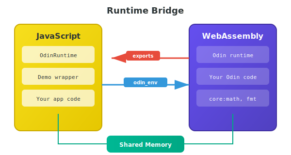

# Building the Runtime Bridge

When you call a WASM function from JavaScript, something has to translate between the two worlds. That's the runtime bridge—the `env` object you pass during instantiation.



## The Minimal Example

Let's start with Odin code that does something useful:

```odin
package main

import "core:math"

@(export)
calculate_circle :: proc "c" (radius: f64) -> f64 {
    return math.PI * radius * radius
}

@(export)
fibonacci :: proc "c" (n: int) -> int {
    if n <= 1 do return n
    
    a, b := 0, 1
    for _ in 2..=n {
        a, b = b, a + b
    }
    return b
}
```

Key points:
- `@(export)` makes functions visible to JavaScript
- `proc "c"` uses C calling convention (required for WASM exports)
- `core:math` works because we're targeting `js_wasm32`

## What Odin Expects

WASM modules compiled with `js_wasm32` expect certain functions in the `env` object. If they're missing, instantiation fails with a `LinkError`.

Required imports:

```typescript
// Math functions (core:math delegates to these)
sin(x: number): number
cos(x: number): number
sqrt(x: number): number
pow(x: number, y: number): number
ln(x: number): number
exp(x: number): number
ldexp(x: number, exp: number): number
fmuladd(a: number, b: number, c: number): number

// Output (fmt.print uses this)
write(fd: number, ptr: number, len: number): number

// Error handling
trap(): never
abort(): never
```

## The Complete Runtime

Here's a runtime class that provides everything Odin needs:

```typescript
class OdinRuntime {
  constructor(private memory: WebAssembly.Memory) {}

  get env(): Record<string, WebAssembly.ImportValue> {
    return {
      sin: this.sin.bind(this),
      cos: this.cos.bind(this),
      sqrt: this.sqrt.bind(this),
      pow: this.pow.bind(this),
      ln: this.ln.bind(this),
      exp: this.exp.bind(this),
      ldexp: this.ldexp.bind(this),
      fmuladd: this.fmuladd.bind(this),
      write: this.write.bind(this),
      trap: this.trap.bind(this),
      abort: this.abort.bind(this),
    };
  }

  // Math
  sin(x: number): number { return Math.sin(x); }
  cos(x: number): number { return Math.cos(x); }
  sqrt(x: number): number { return Math.sqrt(x); }
  pow(x: number, y: number): number { return Math.pow(x, y); }
  ln(x: number): number { return Math.log(x); }
  exp(x: number): number { return Math.exp(x); }
  ldexp(x: number, exp: number): number { return x * Math.pow(2, exp); }
  fmuladd(a: number, b: number, c: number): number { return a * b + c; }

  // Output
  write(fd: number, ptr: number, len: number): number {
    const bytes = new Uint8Array(this.memory.buffer, ptr, len);
    const text = new TextDecoder().decode(bytes);
    if (fd === 1) console.log(text);
    else if (fd === 2) console.error(text);
    return len;
  }

  // Errors
  trap(): never { throw new Error("WASM trap"); }
  abort(): never { throw new Error("WASM abort"); }
}
```

The `env` getter returns a plain object with bound methods. The `.bind(this)` is crucial—without it, methods lose their `this` context when called from WASM.

## Importing Memory

By default, Odin exports its own memory. This creates a chicken-and-egg problem: you need memory to create the runtime, but memory comes from the instance.

The solution is to tell Odin to import memory instead:

```bash
odin build main.odin -file -target:js_wasm32 \
    -extra-linker-flags:"--import-memory"
```

Now you create memory first and pass it to both the runtime and WASM:

```typescript
const memory = new WebAssembly.Memory({ initial: 17, maximum: 256 });
const runtime = new OdinRuntime(memory);

const instance = await WebAssembly.instantiate(wasmModule, {
  env: { memory },
  odin_env: runtime.env,
});
```

Odin can still grow the memory up to the maximum you specify.

## Wrapping It Up

Now wrap everything in a clean API:

```typescript
export class Demo {
  private constructor(
    private instance: WebAssembly.Instance,
    public memory: WebAssembly.Memory,
  ) {}

  static async create(): Promise<Demo> {
    const wasmBytes = await Deno.readFile("demo.wasm");
    const wasmModule = await WebAssembly.compile(wasmBytes);

    const memory = new WebAssembly.Memory({ initial: 17, maximum: 256 });
    const runtime = new OdinRuntime(memory);

    const instance = await WebAssembly.instantiate(wasmModule, {
      env: { memory },
      odin_env: runtime.env,
    });

    return new Demo(instance, memory);
  }

  calculateCircle(radius: number): number {
    return (this.instance.exports.calculate_circle as (r: number) => number)(radius);
  }

  fibonacci(n: number): number {
    return (this.instance.exports.fibonacci as (n: number) => number)(n);
  }
}
```

Usage:

```typescript
const demo = await Demo.create();
console.log(demo.calculateCircle(5));  // 78.53981633974483
console.log(demo.fibonacci(10));       // 55
```

## The Import/Export Contract

This is the fundamental pattern:

- **Exports**: Functions WASM provides to JavaScript (marked with `@(export)`)
- **Imports**: Functions JavaScript provides to WASM (the `env` and `odin_env` objects)

Memory goes in `env`, runtime functions go in `odin_env`.

## Extending the Runtime

Add custom functions by extending the runtime:

```typescript
class CustomRuntime extends OdinRuntime {
  log(ptr: number, len: number): void {
    const text = new TextDecoder().decode(
      new Uint8Array(this.memory.buffer, ptr, len)
    );
    console.log(`[WASM] ${text}`);
  }
}
```

Then in Odin:

```odin
foreign import env {
    log :: proc "c" (ptr: rawptr, len: int) ---
}

debug :: proc(msg: string) {
    env.log(raw_data(msg), len(msg))
}
```

## Performance Note

Every call across the WASM-JavaScript boundary has overhead—roughly 5-10 nanoseconds per call in V8. That's tiny for individual calls, but adds up in tight loops:

```typescript
// 1 million boundary crossings ≈ 5-10ms overhead
for (let i = 0; i < 1000000; i++) {
  result += wasmAdd(i, 1);
}

// One crossing, loop in WASM ≈ 0.00001ms overhead
result = wasmSumRange(0, 1000000);
```

For most applications this overhead is negligible. It only matters when you're calling tiny functions millions of times—keep those hot loops inside WASM.
