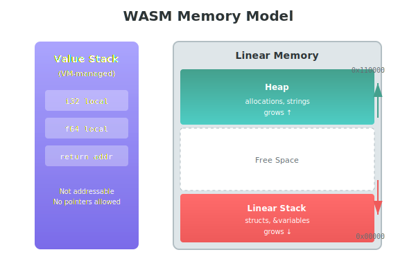

# The Memory Model

WASM has one contiguous block of bytes called linear memory. Understanding it unlocks strings, arrays, and complex data.

## Linear Memory

```typescript
const memory = new WebAssembly.Memory({ 
  initial: 17,   // Must match WASM module's minimum (see below)
  maximum: 256   // Up to 16MB
});
```

That's it. No heap segments, no memory protection. Just bytes at addresses.

## The Two Stacks

WASM actually has two separate stacks:



**Value Stack** (VM-managed)
- Abstract stack for function calls and primitive locals
- Not addressable—you cannot take a pointer to it
- Managed entirely by the WASM runtime
- Where simple `i32`, `f64` locals live

**Linear Stack** (in linear memory)
- Used when variables need addresses (e.g., `&variable`)
- Used for structs returned by value (hidden out-parameter)
- Lives at the beginning of linear memory
- Stack pointer stored in a global variable
- Grows downward like native stacks
- Has a fixed maximum size

## Memory Sizing

The WASM module declares its minimum memory requirement at link time. Odin's runtime typically needs ~1.1MB (~17 pages) for:
- Linear stack space
- Default allocator structures  
- Static data

If you provide less than the module requires, you'll get:
```
LinkError: memory import has N pages which is smaller than the declared initial of 17
```

To reduce the minimum, use linker flags:
```bash
-extra-linker-flags:"--import-memory --initial-memory=131072 -zstack-size=8192"
```

But the linker will error if your code actually needs more. Complex applications may need more.

When you return a struct by value from Odin:
```odin
Point :: struct { x: f64, y: f64 }

@(export)
make_point :: proc "c" (x: f64, y: f64) -> Point {
    return Point{x, y}
}
```

The compiler transforms this to use a hidden out-parameter. The caller allocates space and passes a pointer as the first argument. This is why the TypeScript call looks like:
```typescript
(exports.make_point as Function)(outPtr, x, y);  // outPtr is hidden first arg
```

## Reading and Writing

Create typed array views into memory:

```typescript
const bytes = new Uint8Array(memory.buffer);
const ints = new Int32Array(memory.buffer);
const floats = new Float64Array(memory.buffer);

// Read
const value = bytes[1024];

// Write
bytes[1024] = 42;

// Bulk write
const data = new TextEncoder().encode("Hello");
bytes.set(data, 1024);
```

For structured data, use `DataView`:

```typescript
const view = new DataView(memory.buffer);
view.setFloat64(offset, value, true);  // true = little-endian
const x = view.getFloat64(offset, true);
```

## Memory Growth

Memory can grow at runtime:

```typescript
memory.grow(1); // Add 64KB
```

**Critical**: After growth, `memory.buffer` changes. All existing views become detached:

```typescript
let bytes = new Uint8Array(memory.buffer);
memory.grow(1);
// bytes is now invalid!
bytes = new Uint8Array(memory.buffer); // Create fresh view
```

Always create views just before use, or recreate after potential growth.

## Pointers

A pointer is just a number—an offset into linear memory:

```odin
@(export)
get_data_ptr :: proc "c" () -> rawptr {
    return &global_data
}
```

```typescript
const ptr = getDataPtr(); // e.g., 1048576
const bytes = new Uint8Array(memory.buffer, ptr, size);
```

## Sharing Data

The pattern for passing complex data:

1. Allocate space in WASM memory
2. Write data from JavaScript
3. Call WASM with pointer and length
4. Read results from memory
5. Free allocation (if needed)

```typescript
const str = "Hello";
const encoded = new TextEncoder().encode(str);
const ptr = allocate(encoded.length);

new Uint8Array(memory.buffer).set(encoded, ptr);
processString(ptr, encoded.length);
free(ptr);
```

## Memory Ownership

Be explicit about who owns memory:

- **JavaScript-owned**: JS allocates, passes to WASM, JS frees
- **WASM-owned**: WASM allocates internally, returns pointer
- **Transferred**: JS allocates, WASM takes ownership

Memory leaks in WASM are silent—no garbage collector will save you.

## Debugging

```typescript
function hexDump(memory: WebAssembly.Memory, start: number, len: number) {
  const bytes = new Uint8Array(memory.buffer, start, len);
  console.log(Array.from(bytes).map(b => 
    b.toString(16).padStart(2, '0')
  ).join(' '));
}
```
