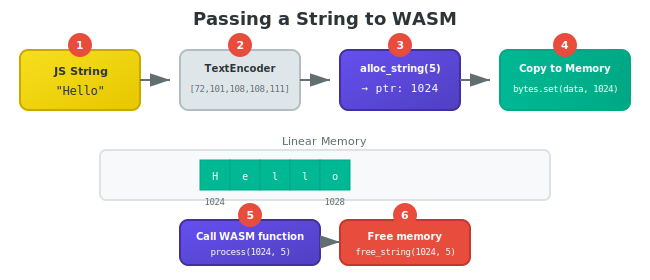

# String Handling

WASM has no string type. Strings are just bytes in linear memory, passed as a pointer and length.

## The Problem

JavaScript and Odin both have memory allocators. They don't know about each other. If you allocate memory from JavaScript and Odin's allocator later uses that same region, your data gets corrupted.

**Solution:** Let Odin handle all memory allocation. JavaScript just writes into memory that Odin allocated.

## Passing a String to Odin



Four steps:

1. Call Odin to allocate memory for the string
2. Write UTF-8 bytes into that memory from JavaScript
3. Call your Odin function with the pointer and length
4. Call Odin to free the memory

**Odin code:**

```odin
import "core:fmt"
import "core:slice"
import "base:runtime"

// Step 1: Odin allocates memory
@(export)
alloc_string :: proc "c" (size: int) -> rawptr {
    context = runtime.default_context()
    return raw_data(make([]byte, size))
}

// Step 4: Odin frees memory
@(export)
free_string :: proc "c" (ptr: rawptr, size: int) {}

// Step 3: Your function that uses the string
@(export)
print_string :: proc "c" (ptr: rawptr, len: int) -> int {
    context = runtime.default_context()
    str := string(slice.from_ptr(cast(^u8)ptr, len))
    fmt.println(str)
    return len
}
```

**TypeScript code:**

```typescript
printString(message: string): number {
  // Convert JS string to UTF-8 bytes
  const bytes = new TextEncoder().encode(message);
  
  // Step 1: Odin allocates
  const ptr = this.exports.alloc_string(bytes.length) as number;
  
  try {
    // Step 2: JavaScript writes into Odin's memory
    new Uint8Array(this.memory.buffer).set(bytes, ptr);
    
    // Step 3: Call Odin function
    return this.exports.print_string(ptr, bytes.length) as number;
  } finally {
    // Step 4: Always free, even if there's an error
    this.exports.free_string(ptr, bytes.length);
  }
}
```

## Why UTF-8?

Odin uses UTF-8 natively. JavaScript is more complicated.

The ECMAScript spec defines strings as sequences of 16-bit (UTF-16) code units, but V8 doesn't actually store them that way. V8 uses two internal representations:

- **One-byte strings:** ASCII-only strings use 1 byte per character (Latin-1 encoding)
- **Two-byte strings:** Strings with any non-ASCII character use 2 bytes per character

Most strings in typical code—identifiers, HTML tags, URLs, JSON keys—are ASCII. V8 stores these efficiently as one-byte strings.

`TextEncoder` and `TextDecoder` with UTF-8 are highly optimized for this common case. For ASCII strings, encoding to UTF-8 is essentially a fast memory copy since ASCII is identical in Latin-1 and UTF-8. The V8 team has invested heavily in these fast paths.

Working with UTF-16 directly would be slower because:

1. There's no equivalent optimized `TextEncoder` for UTF-16
2. Accessing UTF-16 code units from V8's one-byte strings requires conversion
3. Manual byte manipulation with `DataView` can't match the native fast paths

**Bottom line:** Always use `TextEncoder`/`TextDecoder` with UTF-8. It's at least 2x faster than UTF-16 approaches and matches Odin's native encoding.

Note that byte length can differ from character count:

```typescript
const msg = "🎉 Hi";
const bytes = new TextEncoder().encode(msg);

bytes.length  // 7 bytes (emoji is 4 bytes in UTF-8)
msg.length    // 4 characters (emoji is 2 UTF-16 code units)
```

Always pass the **byte length** to Odin, not the string length.

## Getting a String Back from Odin

When you know the maximum size, allocate a buffer and let Odin write into it:

```odin
import "core:mem"

@(export)
get_greeting :: proc "c" (out: rawptr, max_len: int) -> int {
    context = runtime.default_context()
    greeting := "Hello!"
    n := min(len(greeting), max_len)
    mem.copy(out, raw_data(greeting), n)
    return n  // Return actual length written
}
```

```typescript
getGreeting(): string {
  const maxLen = 256;
  const ptr = this.exports.alloc_string(maxLen) as number;
  
  try {
    const actualLen = this.exports.get_greeting(ptr, maxLen) as number;
    return new TextDecoder().decode(
      new Uint8Array(this.memory.buffer, ptr, actualLen)
    );
  } finally {
    this.exports.free_string(ptr, maxLen);
  }
}
```

For dynamic data where you don't know the size upfront, see [Returning Dynamic Data](./ch06b-returning-data.md).

See `examples/foundation/` for working examples.
