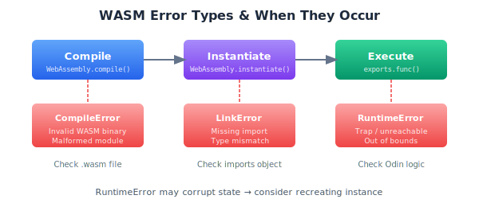

# Error Handling

WASM errors are different from JavaScript errors. When something goes wrong, you need to catch it, understand it, and recover.

## Error Types



### Traps (RuntimeError)

Catastrophic failures: division by zero, out-of-bounds access, unreachable code.

```typescript
try {
  wasmFunction();
} catch (e) {
  if (e instanceof WebAssembly.RuntimeError) {
    console.error("WASM trap:", e.message);
  }
}
```

### Link Errors

Import mismatches during instantiation:

```typescript
try {
  await WebAssembly.instantiate(wasmModule, imports);
} catch (e) {
  if (e instanceof WebAssembly.LinkError) {
    console.error("Missing import:", e.message);
  }
}
```

### Compile Errors

Invalid WASM binary:

```typescript
try {
  await WebAssembly.compile(wasmBytes);
} catch (e) {
  if (e instanceof WebAssembly.CompileError) {
    console.error("Invalid WASM:", e.message);
  }
}
```

## Odin Error Mechanisms

### Assertions

```odin
assert(x > 0, "x must be positive")
```

Calls `evaluate_assertion` in your runtime:

```typescript
evaluate_assertion(
  file_ptr: number, file_len: number,
  line: number, column: number,
  msg_ptr: number, msg_len: number
): never {
  const file = this.readString(file_ptr, file_len);
  const msg = this.readString(msg_ptr, msg_len);
  throw new Error(`Assertion failed at ${file}:${line}:${column} - ${msg}`);
}
```

### Panic

```odin
panic("Something went wrong")
```

Calls `trap()` in your runtime. Less informative than assertions.

## Defensive Programming

Validate before crossing the boundary:

```typescript
calculateCircle(radius: number): number {
  if (!Number.isFinite(radius)) throw new Error("radius must be finite");
  if (radius < 0) throw new Error("radius must be non-negative");
  return this.exports.calculate_circle(radius);
}
```

JavaScript errors are easier to debug than WASM traps.

## Error Recovery

WASM errors may corrupt instance state. For critical applications:

```typescript
class ResilientWasm {
  private instance: Demo | null = null;
  
  async calculate(radius: number): Promise<number> {
    try {
      if (!this.instance) this.instance = await Demo.create();
      return this.instance.calculateCircle(radius);
    } catch {
      this.instance = null;  // Allow GC, will recreate on next call
      throw e;
    }
  }
}
```

Recreate the instance after errors to ensure clean state.

## Common Errors

| Error | Cause | Fix |
|-------|-------|-----|
| `unreachable executed` | Assertion/panic/missing case | Check Odin code logic |
| `out of bounds memory access` | Bad pointer/index | Verify bounds |
| `import odin_env::xyz not found` | Missing runtime function | Add to OdinRuntime |
| `call stack exhausted` | Infinite recursion | Fix recursion base case |
