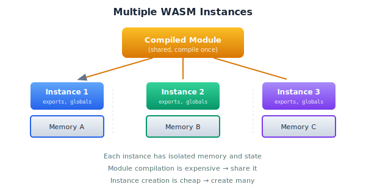

# Multiple Instances

So far we've worked with single WASM instances. But sometimes you need more than one—for isolation, parallelism, or architectural reasons.



## Why Multiple Instances?

### Isolation

Each instance has its own memory. One instance can't corrupt another's state:

```typescript
const instance1 = await Demo.create();
const instance2 = await Demo.create();

// These operate on completely separate memory
instance1.processData(data1);
instance2.processData(data2);
```

Useful when processing untrusted input or when different parts of your application shouldn't share state.

### Parallelism

WASM instances can run concurrently in Web Workers:

```typescript
// worker.ts
const demo = await Demo.create();

self.onmessage = (e) => {
  const result = demo.calculate(e.data);
  self.postMessage(result);
};
```

```typescript
// main.ts
const workers = [
  new Worker("worker.ts", { type: "module" }),
  new Worker("worker.ts", { type: "module" }),
  new Worker("worker.ts", { type: "module" }),
];

// Distribute work across workers
const results = await Promise.all(
  chunks.map((chunk, i) => {
    return new Promise((resolve) => {
      workers[i % workers.length].onmessage = (e) => resolve(e.data);
      workers[i % workers.length].postMessage(chunk);
    });
  })
);
```

### Different Configurations

Same module, different setups:

```typescript
const smallInstance = await Demo.create({ memoryPages: 1 });
const largeInstance = await Demo.create({ memoryPages: 256 });
```

## Creating Multiple Instances

The pattern is straightforward—just call your factory multiple times:

```typescript
const instances: Demo[] = [];

for (let i = 0; i < 4; i++) {
  instances.push(await Demo.create());
}
```

Each instance gets its own:
- Memory buffer
- Global variables
- Internal state

They share:
- The compiled module (efficient)
- Import functions (your runtime)

## Sharing the Compiled Module

Compiling WASM is expensive. Compile once, instantiate many times:

```typescript
class DemoFactory {
  private module: WebAssembly.Module | null = null;
  
  async compile(): Promise<void> {
    if (this.module) return;
    
    const wasmBytes = await Deno.readFile("demo.wasm");
    this.module = await WebAssembly.compile(wasmBytes);
  }
  
  async create(): Promise<Demo> {
    await this.compile();
    
    const memory = new WebAssembly.Memory({ initial: 17, maximum: 256 });
    const runtime = new OdinRuntime(memory);
    
    const instance = await WebAssembly.instantiate(this.module!, {
      env: { memory },
      odin_env: runtime.env,
    });
    
    return new Demo(instance, memory);
  }
}

// Usage
const factory = new DemoFactory();
await factory.compile();

const instance1 = await factory.create(); // Fast - module already compiled
const instance2 = await factory.create(); // Fast
const instance3 = await factory.create(); // Fast
```

## Instance Pooling

For high-throughput scenarios, maintain a pool of ready instances:

```typescript
class InstancePool {
  private available: Demo[] = [];
  private inUse = new Set<Demo>();
  private factory: DemoFactory;
  
  constructor(private maxSize: number) {
    this.factory = new DemoFactory();
  }
  
  async initialize(count: number): Promise<void> {
    await this.factory.compile();
    
    for (let i = 0; i < count; i++) {
      this.available.push(await this.factory.create());
    }
  }
  
  async acquire(): Promise<Demo> {
    let instance = this.available.pop();
    
    if (!instance && this.inUse.size < this.maxSize) {
      instance = await this.factory.create();
    }
    
    if (!instance) {
      throw new Error("Pool exhausted");
    }
    
    this.inUse.add(instance);
    return instance;
  }
  
  release(instance: Demo): void {
    if (!this.inUse.has(instance)) {
      throw new Error("Instance not from this pool");
    }
    
    this.inUse.delete(instance);
    // Reset instance state if needed
    this.available.push(instance);
  }
  
  async withInstance<T>(fn: (instance: Demo) => Promise<T>): Promise<T> {
    const instance = await this.acquire();
    try {
      return await fn(instance);
    } finally {
      this.release(instance);
    }
  }
}

// Usage
const pool = new InstancePool(10);
await pool.initialize(4);

const result = await pool.withInstance(async (demo) => {
  return demo.calculateCircle(5);
});
```

## Shared Memory (Advanced)

Normally, each instance has separate memory. But you can share memory between instances:

```typescript
// Create shared memory
const sharedMemory = new WebAssembly.Memory({ 
  initial: 1, 
  maximum: 256,
  shared: true  // Enable sharing
});

// Both instances use the same memory
const instance1 = await createInstance(sharedMemory);
const instance2 = await createInstance(sharedMemory);
```

**Warning**: Shared memory requires careful synchronization. Without it, you'll have race conditions. This is advanced territory—use only when you understand the implications.

## Communication Between Instances

Instances can't directly call each other. Communication goes through JavaScript:

```typescript
class InstanceCoordinator {
  private instances: Demo[];
  
  constructor(instances: Demo[]) {
    this.instances = instances;
  }
  
  // Fan-out: same operation on all instances
  async broadcast(fn: (demo: Demo) => Promise<number>): Promise<number[]> {
    return Promise.all(this.instances.map(fn));
  }
  
  // Pipeline: output of one feeds input of next
  async pipeline(input: number): Promise<number> {
    let value = input;
    for (const instance of this.instances) {
      value = instance.transform(value);
    }
    return value;
  }
  
  // Map-reduce: distribute work, combine results
  async mapReduce(
    data: number[],
    map: (demo: Demo, chunk: number[]) => number,
    reduce: (results: number[]) => number
  ): Promise<number> {
    const chunkSize = Math.ceil(data.length / this.instances.length);
    const chunks = [];
    
    for (let i = 0; i < data.length; i += chunkSize) {
      chunks.push(data.slice(i, i + chunkSize));
    }
    
    const results = await Promise.all(
      chunks.map((chunk, i) => map(this.instances[i], chunk))
    );
    
    return reduce(results);
  }
}
```

## Testing Multiple Instances

Verify instances are truly independent:

```typescript
Deno.test("Multiple instances are isolated", async () => {
  const demo1 = await Demo.create();
  const demo2 = await Demo.create();
  
  // Modify state in instance 1
  demo1.setState(42);
  
  // Instance 2 should be unaffected
  assertEquals(demo2.getState(), 0); // Default value
});

Deno.test("Instances can run concurrently", async () => {
  const demo1 = await Demo.create();
  const demo2 = await Demo.create();
  
  // Run simultaneously
  const [result1, result2] = await Promise.all([
    demo1.heavyComputation(1000),
    demo2.heavyComputation(1000),
  ]);
  
  // Both should complete successfully
  assertEquals(typeof result1, "number");
  assertEquals(typeof result2, "number");
});
```

## Performance Considerations

**Instance creation cost**: Creating instances is fast (~0.1ms median). Pooling is rarely necessary.

**Memory overhead**: Each instance has its own memory. 10 instances with 1MB each = 10MB total.

**Module sharing**: Always share the compiled module. Compilation is the expensive part.

**Boundary crossings**: Communication between instances goes through JavaScript. Minimize back-and-forth.

## When to Use Multiple Instances

**Use multiple instances when**:
- Processing untrusted or isolated data
- Parallelizing CPU-intensive work
- Different parts of your app need different configurations
- You need to reset state cleanly between operations

**Stick to single instance when**:
- Memory is constrained
- Operations are sequential anyway
- State sharing is required
- Simplicity matters more than isolation

Multiple instances are a powerful tool. Use them when the architecture calls for it, but don't add complexity without clear benefit.
