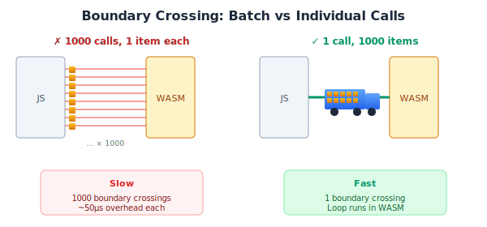

# Real-World Applications

This is where WASM earns its keep. Heavy computation that would choke JavaScript runs smoothly in WASM.

## Computational Workloads

### Batch Processing

Move loops into WASM. One boundary crossing beats a million:



```odin
@(export)
mandelbrot_row :: proc "c" (
    y: int, width: int,
    x_min, x_max, y_val: f64,
    max_iter: int, out: [^]u8,
) {
    x_step := (x_max - x_min) / f64(width)
    for px in 0..<width {
        cx := x_min + f64(px) * x_step
        escape := mandelbrot_escape(cx, y_val, max_iter)
        out[px] = u8(escape * 255 / max_iter)
    }
}

mandelbrot_escape :: proc(cx, cy: f64, max_iter: int) -> int {
    x, y: f64 = 0, 0
    for i in 0..<max_iter {
        if x*x + y*y > 4.0 do return i
        x, y = x*x - y*y + cx, 2*x*y + cy
    }
    return max_iter
}
```

```typescript
function renderMandelbrot(demo: Demo, width: number, height: number): Uint8Array {
  const rowPtr = demo.allocate(width);
  const pixels = new Uint8Array(width * height);
  
  for (let py = 0; py < height; py++) {
    const yVal = -2 + py * 4 / height;
    demo.mandelbrotRow(py, width, -2, 2, yVal, 256, rowPtr);
    pixels.set(new Uint8Array(demo.memory.buffer, rowPtr, width), py * width);
  }
  
  demo.deallocate(rowPtr, width);
  return pixels;
}
```

### Matrix Operations

```odin
@(export)
matrix_multiply :: proc "c" (a, b, c: [^]f64, m, k, n: int) {
    for i in 0..<m {
        for j in 0..<n {
            sum: f64 = 0
            for p in 0..<k {
                sum += a[i*k + p] * b[p*n + j]
            }
            c[i*n + j] = sum
        }
    }
}
```

### Statistics

```odin
@(export)
statistics :: proc "c" (data: [^]f64, len: int, out: [^]f64) {
    // out: [mean, variance, min, max]
    if len == 0 { out[0], out[1], out[2], out[3] = 0, 0, 0, 0; return }
    
    sum, min_val, max_val: f64 = 0, data[0], data[0]
    for i in 0..<len {
        sum += data[i]
        if data[i] < min_val do min_val = data[i]
        if data[i] > max_val do max_val = data[i]
    }
    mean := sum / f64(len)
    
    var_sum: f64 = 0
    for i in 0..<len {
        diff := data[i] - mean
        var_sum += diff * diff
    }
    
    out[0], out[1], out[2], out[3] = mean, var_sum / f64(len), min_val, max_val
}
```

## Data Structures

### Passing Arrays

```typescript
function processArray(demo: Demo, values: number[]): Float64Array {
  const data = new Float64Array(values);
  const ptr = demo.allocate(data.byteLength);
  new Float64Array(demo.memory.buffer, ptr, data.length).set(data);
  
  demo.processInPlace(ptr, data.length);
  
  const result = new Float64Array(demo.memory.buffer, ptr, data.length).slice();
  demo.deallocate(ptr, data.byteLength);
  return result;
}
```

### Structures

Match layouts in both languages:

```odin
Point :: struct {
    x: f64,  // offset 0
    y: f64,  // offset 8
}
```

```typescript
const POINT_SIZE = 16;

function writePoint(memory: WebAssembly.Memory, ptr: number, p: {x: number, y: number}) {
  const view = new DataView(memory.buffer);
  view.setFloat64(ptr, p.x, true);
  view.setFloat64(ptr + 8, p.y, true);
}

function readPoint(memory: WebAssembly.Memory, ptr: number): {x: number, y: number} {
  const view = new DataView(memory.buffer);
  return { x: view.getFloat64(ptr, true), y: view.getFloat64(ptr + 8, true) };
}
```

### Arrays of Structures

```odin
@(export)
closest_point :: proc "c" (points: [^]Point, count: int, target: ^Point) -> int {
    if count == 0 do return -1
    best_idx, best_dist := 0, distance(&points[0], target)
    for i in 1..<count {
        if d := distance(&points[i], target); d < best_dist {
            best_dist, best_idx = d, i
        }
    }
    return best_idx
}
```

```typescript
function closestPoint(demo: Demo, points: Point[], target: Point): number {
  const arrayPtr = demo.allocate(points.length * POINT_SIZE);
  const targetPtr = demo.allocate(POINT_SIZE);
  
  for (let i = 0; i < points.length; i++) {
    writePoint(demo.memory, arrayPtr + i * POINT_SIZE, points[i]);
  }
  writePoint(demo.memory, targetPtr, target);
  
  const result = demo.closestPoint(arrayPtr, points.length, targetPtr);
  
  demo.deallocate(arrayPtr, points.length * POINT_SIZE);
  demo.deallocate(targetPtr, POINT_SIZE);
  return result;
}
```

## When WASM Wins

WASM excels at:
- Tight loops with numeric computation
- Large array operations
- Predictable memory access patterns

WASM doesn't help with:
- I/O-bound operations
- Small, infrequent calculations
- Operations dominated by boundary crossing

Profile first. Optimize where it matters.
